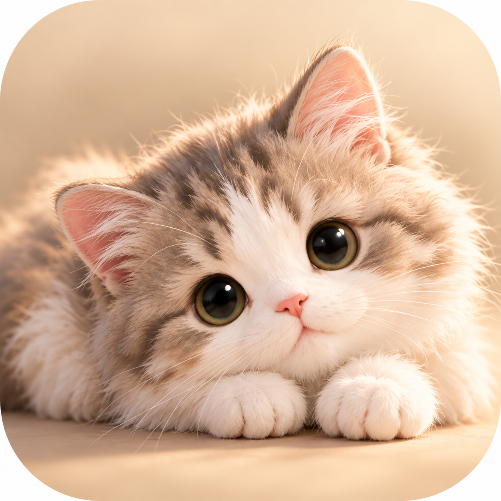

# 灵犀 Lingxi

> 你忙你的，我在这里。

一只安静住在桌面上的 3D 小猫。它在屏幕边缘自己遛达、做自己的事、躲开你的鼠标，
你逗它它会玩，你的 Agent 干完活它会有反应。



macOS · Tauri 2 + Rust + TypeScript + Three.js · 无第三方运行时依赖（除 three 与 Tauri 本体）

---

## 它现在能做什么

- **自己活着。** 沿屏幕边缘巡逻，会拐弯（有转弯半径，不是原地掉头），走路时脚是**踩在地上的**
  （支撑相足部在世界坐标里静止），停下来会自己做动作、换表情。
- **躲着你干活。** 鼠标是你正在工作的地方，所以它不往那儿去——连"落脚点"都不会选在光标附近。
- **能玩。** 毛线球（跟着鼠标、点击蓄力、甩出去，会滚会反弹，猫会追会拍）、逗猫棒（猫会潜伏、
  立起来够、原地起跳）、激光笔（带拖尾，永远抓不住）。
- **有反应。** 鼠标停在它身上会抬头看你，来回摸会眯眼呼噜，双击会用头蹭你。
- **会说话。** 头顶漫画气泡，钉在头骨投影上，蹲下跳起换视角都跟得住。
- **能演。** 三段全屏特效，按动漫运镜编排：从屏幕深处冲过来越来越大、集中線、命中闪白、震屏。
- **可以改。** 动作、表情、主题都是可编辑的 JSON；支持手绘身体图集和表情图。
- **接 Agent。** MCP server + Claude Code hooks + 纯 HTTP，任务完成/失败会有表情动作，
  能记住关于你的事，能过一会儿提醒你。

---

## 跑起来

需要 Node.js 22+ 和 Rust（`rustup`，仓库里有 `rust-toolchain.toml` 锁定版本）。

```sh
npm ci --ignore-scripts
cd apps/lingxi && npm ci

npm run tauri dev            # 开发
npm run tauri build          # 打包出 .app
```

托盘图标里有：主界面、调试台、大小、玩具、特效、显示/隐藏。

### 开发辅助页

跑 `npm run dev`（在 `apps/lingxi` 里）后可以打开，这些页面不在打包产物里：

| 页面 | 用途 |
|---|---|
| `/app-harness.html` | 不经 Tauri 直接跑真实渲染路径，在浏览器里调试 |
| `/probe-gait.html` | **回归探针**：身体抖动、脚底打滑、自由模式行为统计 |
| `/probe-clips.html` | 逐个动作检测穿模，按严重程度排序 |
| `/probe-framing.html` | **回归探针**：各视角 / 各尺寸下屏幕四边各裁掉猫的多少 |
| `/rig-preview.html` `/style-lab.html` | 骨架和配色试验 |

`probe-gait.html` 是几个结构性 bug 的回归检查，健康值写在文件头部。改动画系统之前先看它。

---

## 架构

三层，互相之间只通过契约通信，任何一层都可以单独换掉。

```
packages/life-engine        纯行为状态机。没有 DOM、没有渲染、没有 Tauri。
     │                      只知道一个 2D 世界和一个光标。可单元测试。
     │  snapshot { state, position, heading, toy, ... }
     ▼
apps/lingxi/src/renderer    Three.js 场景。不知道桌面宿主的存在。
     │                      骨架 / 步态 / 脊柱弯曲 / 相机 / 主题 / 特效层
     ▼
apps/lingxi/src-tauri       窗口、托盘、设置持久化、本机 HTTP 桥
```

关键点：

- **朝向由引擎持有，不是从位移反推的。** 猫只能沿着 `heading` 前进，转向有角速度上限和最小
  转弯半径。这条是很多稳定性问题的根因——一旦朝向是位置的导数，位置的任何抖动都会变成
  朝向的抖动，并被相机的透视比例放大。
- **步态由距离驱动，不是时钟。** 一个步幅的地面距离推进一个步态周期，所以任何速度下脚都不打滑。
- **落地高度是姿态的属性**，不是"这一帧哪只爪子最低"。
- **边界是按身体算的，不是按锚点算的。** 引擎操纵的点是猫的**脚**，身体整个画在它上方，所以
  四条边不能用同一个 margin——上边用 24px 会把整只猫顶出屏幕。渲染器量出身体在屏幕上的实际
  跨度（`screenExtent()`），宿主据此给出四个不同的边距：左右可以露一半（这是要保留的观感），
  上下则整只猫都留在屏幕内——猫高约为宽的三倍，同样的比例在侧面切掉的是身侧，在上面切掉的是
  **脑袋**，而表情是这东西的全部意义。
- **特效层是 DOM/SVG，全程 `pointer-events: none`。** 全屏特效不会吞掉你的任何一次点击。

细节见 [`docs/05-technical-architecture.md`](docs/05-technical-architecture.md)。
过期但有参考价值的早期文档在 [`docs/archive/`](docs/archive/README.md)。

---

## 自定义

主界面 → 外观 → 「导出内置资源为模板」，会在应用配置目录写出：

```
assets/
  actions.json       动作库      改完在界面上点「重新加载」即可，不用重新编译
  expressions.json   表情
  skins.json         主题
  textures/*.png     手绘身体图集 / 表情图
  README.md          格式说明（应用自己写的）
```

**每个文件都会先完整校验再生效。** 格式不对时保留内置版本、在界面上显示具体哪一行不对，
不会出现半张脸或者关节拧断的情况。

---

## 接 Agent

一个本机 HTTP 桥（`127.0.0.1:47811`，只监听回环），三种接法：MCP server、Claude Code hooks、
直接 HTTP。完整说明见 [`integrations/README.md`](integrations/README.md)。

```jsonc
// 任何 MCP 客户端
{ "mcpServers": { "lingxi": { "command": "node", "args": ["<repo>/packages/mcp-server/src/index.mjs"] } } }
```

十个工具：看能力、看状态、说话、表情/动作、全屏特效、放玩具、记住一件事、读回记忆、设提醒、换视角主题。

---

## 测试

```sh
npm test          # 全部包的单元测试
npm run check     # 项目规范检查
cd apps/lingxi && npx tsc --noEmit && cd src-tauri && cargo test
```

行为、转向、玩具、交互反应都有测试。渲染和动画不适合单元测试，用上面的探针页面量化回归。

---

## 现状与边界

**能用，在日常使用中。** 但要说清楚没做到的：

- 只支持 macOS。窗口、托盘、光标读取都走 AppKit。
- 多显示器下光标坐标的 y 翻转只按主屏计算，副屏上会不准。
- 摆动中的爪子会低于地平面最多约 0.7 体素。桌面没有画地板所以看不出穿模，真正的解法是
  世界空间踩地锁定 + 双骨 IK。
- 部分蜷缩类动作（打滚、侧卧、挠耳朵）后腿和躯干有重叠，见 `probe-clips.html` 的排序。
- 系统鼠标指针无法隐藏，所以逗猫棒/激光笔是画在光标位置上，不是替换了指针。
- 人格倾向滑杆目前只持久化，行为引擎还没消费它们（界面上标了「即将生效」）。

---

## 许可

见 [LICENSE.md](LICENSE.md)。
