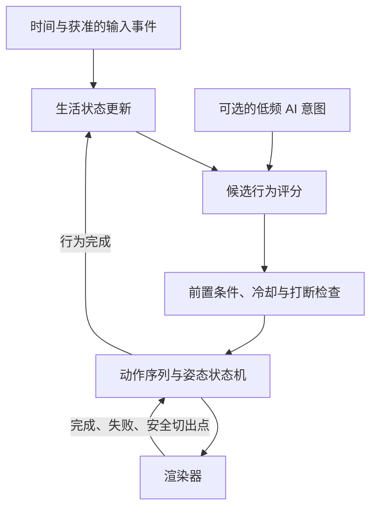
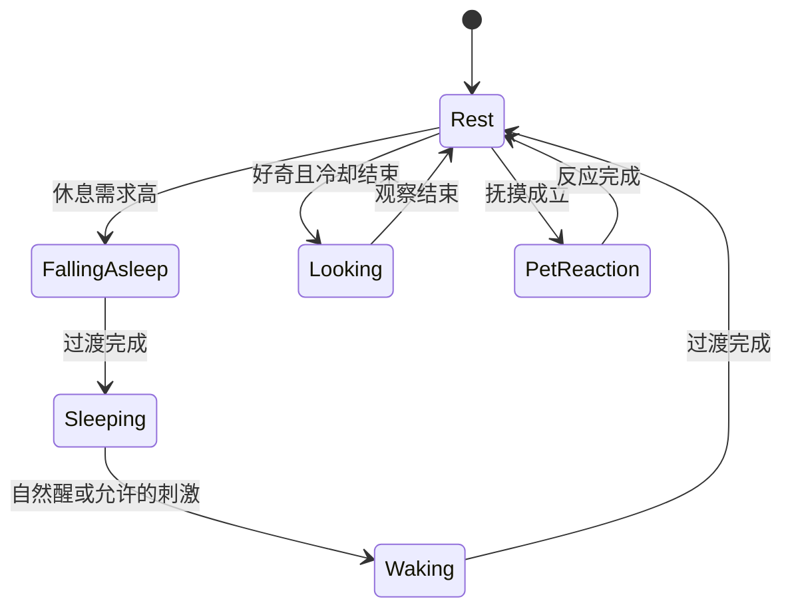

# Cat Life Engine：行为系统

> 历史基线（2026-09-10）：产品现已命名「灵犀」，用户要求以真实实时 3D 为目标。最新决定见 [实时 3D 决策](decisions/001-realtime-desktop.md)、[品牌设计](08-brand-and-design-system.md)和[扩展架构](09-extension-architecture.md)。与新决定冲突的旧建议不再适用。

状态：**部分已实现**。这份文档最初整篇是设计草案，现在它描述的东西有一部分在跑，所以先说清楚边界
——否则它会以另一个方向重犯"文档与代码不同步"的毛病。

**已经实现并有测试的（见 `packages/life-engine`，12 个用例在 `test/vitals.test.mjs`）**

| 本文里的设计 | 实现 |
|---|---|
| 生活变量 `energy` / `sleepiness` | 有。0～1，按小时变化，清醒时消耗、睡眠时恢复；走路比静止耗得快 |
| 时段权重 | 有。`nightness` 由本地时钟推出，凌晨 3 点最高，把困意上升速率在 0.55～1.75 倍之间拉动 |
| 睡眠闭环 | 有。困意越过阈值且已安定下来 → `sleep` 状态 → 恢复 → 自己醒来并伸个懒腰 |
| 人格影响行为权重 | 有。五项滑杆进入引擎：独立/好奇改休息时长，温柔改步速，玩心改追玩具的劲头，贪睡改入睡阈值。全部在 0.5 时等于调校好的默认值 |
| 系统休眠后的时间上限 | 有。一次 tick 最多推进 15 分钟的生活变量，合盖八小时不会让猫瞬间累垮 |

**仍然只是设计**

- `comfort`（舒适度）、`curiosity` 作为**变量**（好奇目前只是人格项，不是会涨落的量）
- Utility AI 打分选行为：现在的动作选择仍在渲染层的 director 里，不按生活变量打分
- 最短驻留、切换优势阈值、重复惩罚、行为冷却（第 4 节）——动作层面的这套约束还没有
- 情绪层作为独立概念（表情目前由反应映射和 director 直接给）
- 记忆与连续性中的"生活状态版本"落盘（vitals 目前只存在于内存，重启从既定初值开始）

## 1. 分层与术语

| 术语 | 定义 | 例子 |
| --- | --- | --- |
| 生活变量 | 连续变化的内部数值 | 精力、困意、舒适度、好奇心 |
| 情绪 | 影响表达的短期状态 | 放松、好奇、困倦 |
| 意图 | 高层行为倾向 | 休息、观察、待在附近 |
| 行为 | 有前置条件和结束条件的任务 | 进入睡眠、观察指针 |
| 动作片段 | 可实际播放的资产 | `sleep_to_rest` |
| 微动作 | 局部或片段内的细微变化 | 眨眼、耳动、呼吸 |
| 人格 | 缓慢或固定的倾向 | 独立、温柔、懒散 |

眼睛看向指针不等于看见用户本人；时间感知不等于知道现实环境光。表现设计可以参考时段，但不应声称感知了未采集的信息。

## 2. 职责链



Utility AI 负责“选什么”，状态机负责“如何合法衔接”，动作序列负责“按什么步骤完成”。MVP 不需要同时引入通用行为树框架；只有序列和条件明显复杂后再评估。

## 3. 首版状态与更新

生活变量建议归一化到 0～1：`energy`、`sleepiness`、`comfort`、`curiosity`。人格先固定为配置；信任、依恋与饥饿保留为后续设计，避免一开始引入无法验证的耦合。

精力与困意分别表示短期活动能力和睡眠压力：玩耍消耗精力，清醒时间提高困意，睡眠使二者恢复。具体变化速率先通过模拟调校；如果无法解释二者差异，P0 可合并为一个休息需求。

行为层约每秒更新一次或在事件到达时更新，使用真实经过时间计算变化；渲染使用独立帧率。数值范围、速率和时段曲线集中配置，不散落在动画代码中。系统休眠后对经过时间做上限处理，不补发过去的行为事件。

## 4. 决策规则

先过滤不可执行候选：资产缺失、姿态不兼容、冷却未结束、用户正在拖动、系统暂停等。然后根据生活变量、时段、人格和可选意图计算分数，再在少量高分候选之间做有界随机选择。

需要同时具备：最短驻留时间、切换优势阈值、重复惩罚、行为冷却、输入合并。随机只能影响合法选择，不能让睡眠和好奇每秒交替。调试时可固定随机种子，记录选择原因。



隐藏、退出和拖动属于更高优先级的交互控制，可以立即介入；退出不应等待猫完成动画。睡眠中的普通指针路过不必唤醒它。

## 5. 交互与微动作

抚摸反应延迟沿用原文的 0.2～1.2 秒作为调参范围，而非每次必回应。移动事件应采样和合并，动作未完成时不重新排队；睡眠和拖动降低或关闭抚摸检测。

实时路线可用眼、头、身体依次转向以及局部动画叠加。预渲染路线使用已制作的方向片段与微动作变体，不能承诺连续转头或独立程序化尾巴。两条路线都由同一行为层请求“观察”等语义行为。

## 6. AI 边界

M1 的生活闭环不依赖 LLM。后续 AI 只接收获准的摘要和当前状态，返回有时效的高层意图，例如：

```json
{
  "schemaVersion": 1,
  "intent": "stay_near",
  "emotion": "calm",
  "interaction": "none",
  "ttlSeconds": 300
}
```

这是概念协议。实现时用枚举、期限和幅度约束验证；未知值、超时或过期响应一律忽略并继续本地行为。AI 不指定骨骼、不绕过打断规则、不调用操作系统，也不能因意图缺少对应资产而让猫卡住。

调用只考虑有意义的摘要变化或用户主动交互，配合冷却、每日预算和失败退避；每秒生活更新不触发模型请求。主动语言独立受用户开关与频率上限控制。

## 7. 记忆与可验证性

M1 保存位置、设置、生活状态版本和更新时间即可体现连续性。M2 再讨论用户明确偏好和少量互动摘要；语义记忆应能查看、删除，不能将模型猜测持久化成用户事实。

后续实现需验证：固定输入和种子可重放；缺失资产可回退到待机；动作完成前不发生非法跳转；连续输入不无限排队；断网仍正常；睡眠恢复无积压；状态文件损坏能恢复默认值。
