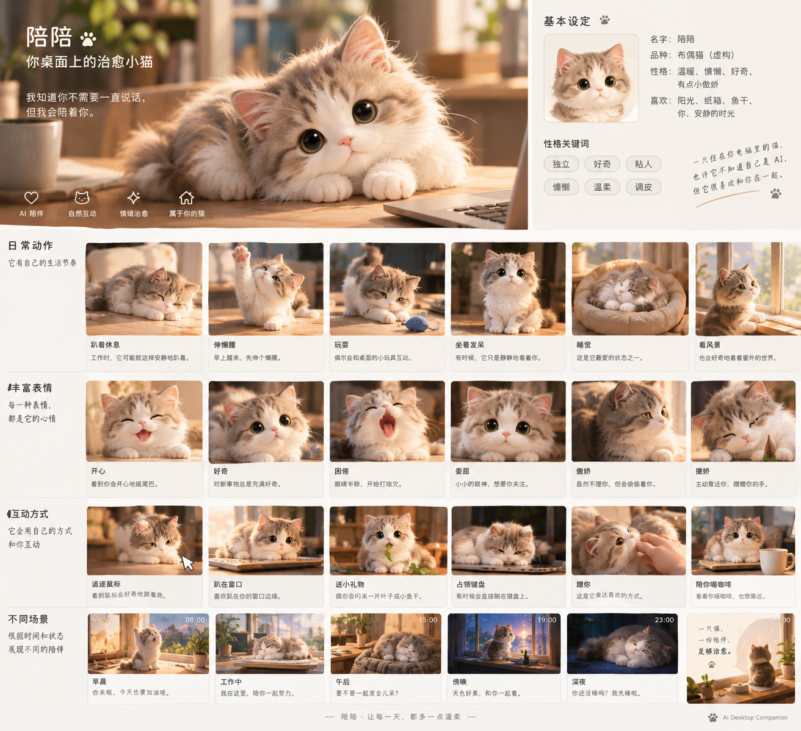

# 视觉方向与补充思考

> 历史基线（2026-09-10）：产品现已命名「灵犀」，用户要求以真实实时 3D 为目标。最新决定见 [实时 3D 决策](decisions/001-realtime-desktop.md)、[品牌设计](08-brand-and-design-system.md)和[扩展架构](09-extension-architecture.md)。与新决定冲突的旧建议不再适用。

来源：用户在 2026-09-10 补充的文字分析及概念板。本文是提炼记录，不是逐字转录。材料内部提出的生成图片、开始建模等建议作为讨论内容保存，不视为本轮执行指令。

## 1. 新材料补充了什么

核心审美可表述为：**一只舒服、安静、毛茸茸的小猫，像恰好生活在你身边。** 用户可能愿意长期观看的，是它自然休息的状态，而不仅是夸张卖萌的瞬间。这里“可能”很重要：材料对选择动机的分析是设计假设，不是已验证的个人心理结论。

新材料引用了 2、4、6、9、16、24～32 等编号猫的偏好分析，但未提供对应完整编号图集，不能据此核验每个编号的外观和排序。本轮附图是一张陪陪产品概念板，不把它当作那份编号图集。

## 2. 从附图能直接观察到的内容

主视觉中的猫趴在暖光木桌上，头略倾斜，灰棕与暖白毛色，白色面部和爪子，眼睛大而有反光，粉色小鼻子，毛发轮廓蓬松。背景是虚化的室内植物与窗光。

概念板包含日常动作、表情、互动和时段示例；这些小图可作为情绪板和动作意图参考，尚不具备统一相机、尺寸、姿态与身份校对，不能直接当动画关键帧或建模正交图使用。

图中文字写“布偶猫（虚构）”，而前文建议不明确绑定真实品种。暂保留为命名差异，以主猫外观为准，待角色冻结时统一。

## 3. 转化成设计规则

| 方向 | 可执行规则 | 检查方式 |
| --- | --- | --- |
| 真实存在感 | 保持重心、呼吸、接触关系与动作连续 | 连续观看，检查漂浮、滑动、突然变形 |
| 轻度幼态 | 适度圆头、短口鼻、小爪，不无限放大眼睛 | 在目标尺寸对比候选，避免仅放大图好看 |
| 柔软 | 毛发轮廓、体积与自然压靠 | 在深浅背景检查，不只看暖光宣传图 |
| 安静 | 休息作为主画面，少量微动作 | 不互动时观察 10 分钟 |
| 非刻意感 | 不持续盯人、微笑或摆拍 | 检查默认状态是否过度索取注意 |
| 温暖 | 克制的暖色倾向、必要的接触阴影 | 透明桌面中验证，避免过强橙色滤镜 |

“90% 自主生活、10% 互动”和原文其他比例一样，是方向比喻，不按精确概率实施。自主行为应有上下文，“随机”不是无限随机抽动作。

## 4. 概念板与首版产品的边界

图中窝、杯子、窗台、键盘与完整室内空间增强了“它在这里生活”的感觉，但桌面透明叠层没有这些真实承托物。需要单独验证：只保留猫后，用户是否仍觉得它舒服、自然；小垫子或猫窝是否改善效果而不过度占屏。

追鼠标、趴真实窗口、占领键盘、送礼物，以及多个带文案的时段场景，均为概念展示，不自动加入 M1。尤其“占领键盘”不能演变成阻断用户工作，“委屈”不能用于催促照料或付费。

图中的晨间鼓励和夜间问候可作为后期语气参考，不能据此让第一版按时主动说话。“它不知道自己是 AI”作为虚构角色设定保留，不作为有关系统意识的事实陈述。

## 5. 心理学解释的使用范围

补充文字用 Baby Schema、感知生命感、情绪感染和恐怖谷解释偏好。本轮未进行心理学文献核验，将它们记录为设计研究线索，不据此声称用户必然被治愈，或真实猫风格必然导致恐怖谷。“治愈”在产品中表达轻松温暖的主观体验，不是疗效承诺。

后续访谈应问“你为什么愿意把这只猫留在桌面”“哪些时刻想关闭它”，而不是用理论替用户决定原因。

## 6. 可选的六候选实验

补充材料提出 A 真实小奶猫、B 3D 毛绒小猫、C 真实与手办之间、D 低饱和暖光、E 睡觉陪伴、F 极简真实。它们同时改变了造型、材质、光照和姿态，直接比较容易把背景偏好误判为角色偏好。

建议把这六类先作探索标签。正式选择时统一画幅、机位、背景和尺寸，先比较造型与材质；再用选中的同一角色比较休息姿态与光照。每个候选都应有透明桌面小尺寸预览。

如果当前主图已是最想每天看到的一只，就直接围绕它补齐身份参考，不必为流程完整而重新生成六只。本轮未生成新图。
