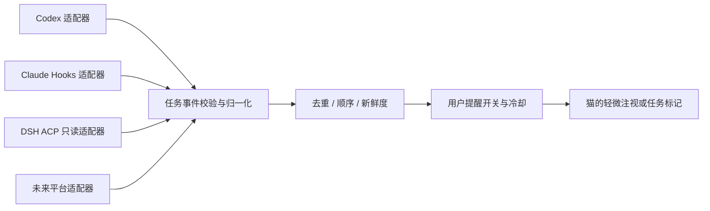

# 换肤、性格与 Agent 任务观察

2026-09-11。用户明确要求未来多皮肤、多性格与 Codex / Claude / DeepSeek Harness 任务观察。当前已实现独立配置契约和验证、任务状态归一化存储及其测试；实时平台连接仍属于后续功能。

## 角色扩展

`SkinManifest` 描述皮肤 ID、兼容 rig、材质颜色与生产状态；`PersonalityManifest` 描述独立、好奇、温柔、玩心、困意倾向及交互冷却。二者由 `composeCompanion` 组合，不互相绑定。暖绒虎斑和银灰云朵是两个计划皮肤，安静陪伴和温柔好奇是两个可验证性格配置。

当前颜色配置并不代表完整生产皮肤。正式 `SkinManifest v2` 需要增加受约束的相对资产路径、版本哈希、贴图遮罩、LOD、动画兼容列表和许可证记录。加载器拒绝路径越界和可执行脚本；先验证完整资产再原子替换，失败保留旧皮肤。人格变化应平滑过渡，不重置猫的长期身份与记忆。

接口见 [contracts](../packages/contracts/src/index.d.mts)，数据见 [皮肤](../presets/skins/warm-tabby.json)和[性格](../presets/personalities/quiet.json)。当前没有伪造模型路径来暗示资产已完成。

## 观察层

统一事件包含平台、来源、任务、事件 ID、序号、观察时间及状态；任务主键包含平台和来源，防止跨平台同名碰撞。状态为排队、运行、等待用户、完成、失败、取消、未知。断连只标过期，不推断完成。摘要长度限制 240 字；输入中的 prompt、工具参数等原始字段不会进入规范化事件。

`TaskObserver` 只提供连接、快照、事件流和断开；不提供批准、执行、取消接口。未来增加平台不需要修改猫的动画系统。

## 已核对的接入路径

| 平台 | 来源与接口 | 边界 |
| --- | --- | --- |
| Codex | App Server `thread/status/changed`、`turn/started`、`turn/completed` | 只能观察已连接服务可见的任务；不声称新开 app-server 能自动观察桌面应用全部任务 |
| Claude Code | Hooks `UserPromptSubmit`、`PermissionRequest`、`Stop`、`StopFailure`；权限提示可补 Notification | Stop 是一轮停止，不等于用户目标完成；不输出批准决策；需安装用户选择的 Hooks |
| DeepSeek Harness | 用户项目 `dsh-acp` 的 `dsh/jobs/list`、`dsh/agents/tree`、`dsh/sessions/watch` 与 `dsh/changed` | 客户端通过能力协商选择 vendor 扩展；未知状态保持 unknown；不调用 resume/prompt/cancel |

Codex 的 `turn/completed` 带 completed/interrupted/failed；turn 与用户长期目标应分别建模。[官方 App Server 文档](https://developers.openai.com/codex/app-server/)

Claude 的 StopFailure 表示 API 错误终止；权限 Hook 可能影响批准，因此观察实现必须只记录元数据并退出，不返回控制字段。[Claude Hooks](https://code.claude.com/docs/en/hooks)

DSH 已读取用户仓库实现，参考提交 `e63dd06ccbebb68bc380532d5758968b17e247e4`；任务列表含 id、kind、label、status、ownerSession、startedAt、finishedAt。[dsh-acp](https://github.com/dushaobindoudou/dsh-acp)

## 提醒节制与可靠性

默认关闭任务提醒。开启后，运行中的每一步保持安静；完成仅轻微抬头，失败或等待用户显示清晰但克制的标记。多个事件合并，设置冷却；安静模式抑制动画与声音。成功、失败与断连必须有文字区分，不能仅用猫的表情传达重要状态。

重连先快照对账，再接增量；适配器管理来源 epoch 与顺序。数据保留设置、任务删除和 source 清理必须在实现传输层时补齐，避免无限增长。当前 TaskStore 已提供 forget，不声称具有完整保留策略。

## 验证边界

现有测试覆盖去重、乱序、来源隔离、过期、无关字段剔除、配置解耦、rig 兼容和提醒开关。尚未对三个平台执行真实在线观察，不将协议文档或单元测试当成端到端连通证据。
