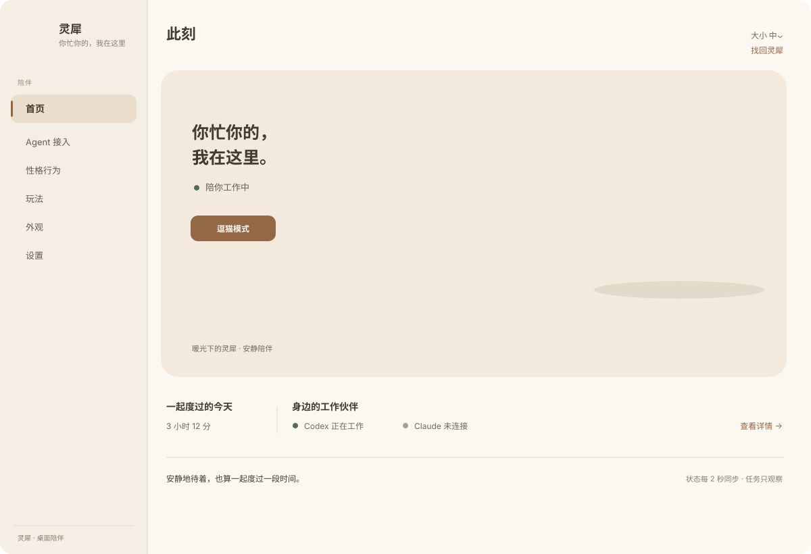
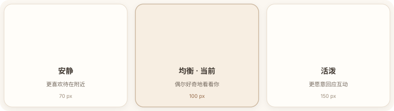

# 托盘菜单与主界面设计方案

状态：设计与实现基线 v2，2026-09-23。用于约束 Tauri 原生托盘菜单和 `management.html` 管理窗口；首页场景、任务摘要、简洁托盘和桌面窗口尺寸已按本文实现。本文是后续修改的产品约定，运行状态以应用真实数据为准。

## 目标

托盘是“随手照看”的快捷入口，主界面是“停下来遇见灵犀”的陪伴空间。两者共用 Rust `TrayState`，菜单项直接改状态，窗口打开时读取同一份权威状态。视觉沿用 [品牌设计系统](08-brand-and-design-system.md) 与 [设计变量](../assets/brand/design-tokens.json)：暖白、燕麦、深棕、少量暖杏；稳定状态使用低饱和绿；猫仍是灰棕虎斑、暖白脸和前爪、榛绿眼与粉鼻。

上一版的问题在于“卡片、计数和 Agent 行”主导视觉，猫只像一张悬浮贴纸。治愈感不能只靠暖色与圆角，而应先来自一个可信的生活片刻：猫有安放身体的桌面，暖光和柔和背景形成空间，界面文字与控件安静地退到场景边缘。因此 v2 把首屏主角从数据卡改成“窗边休息的灵犀”，数据与连接状态压缩到场景下方。

建议首版维持 macOS 原生菜单 + 独立主界面窗口，不把 WebView 伪装成系统菜单。原生菜单的键盘、焦点、系统主题适配更自然；主界面承载猫插画、状态摘要和更丰富的设置。主界面是从托盘菜单进入的下一层，不嵌在原生菜单里。

## 功能与信息布局

### 托盘菜单：只放高频、可立即逆转的操作

按组排列，使用原生菜单行、勾选和子菜单，不加彩色卡片、不塞长说明：

1. **状态摘要（禁用行）**：`<猫名> · <此刻真实状态>`，随状态更新（`tray_status_text`）：猫隐藏时 `藏起来了`；有 agent 正在干活时 `陪 Claude Code、Codex 工作中`（超过两个写"等 N 个伙伴"，30 分钟没动静的不算）；否则 `在桌面陪着你`。它曾经固定写着 `灵犀 · 陪你工作中`——一行看起来像状态的灰字，在猫隐藏、改名、一整天没有 agent 时照样这么说。次行显示 `目前没有需要留意的任务`，或在有失败/等待状态时显示数量；不提供 agent 批准、取消等动作。
2. **显示**：`显示灵犀` / `隐藏灵犀`，根据当前状态切换单一文案。
3. **大小** 子菜单：小 / 中 / 大，当前值勾选。
4. **互动** 子菜单：`逗一逗` 放出逗猫棒，`收起玩具` 随时结束互动。玩具是一次互动，不是全局“日常/逗猫”模式。
5. 分隔线。
6. **打开灵犀…**：打开或聚焦主界面，是唯一主入口；系统原生菜单中保持短且清晰。
7. **退出灵犀**：始终可见，置底。

把“形状”改叫“大小”；其他玩具和特效留在主界面或猫身交互入口，避免把原生菜单变成功能目录。托盘只保留最常用的逗猫棒与对应的收起操作。

### 主界面首页：先遇见灵犀，再读状态

主界面是既有桌面管理窗的首页，不是 420×600 的手机式窄卡。窗口已按本文落地为 **960×680 logical px、可缩放、最小 860×620**（`open_or_focus_management_window`），保留桌面侧栏导航。SVG 以 1200×820 设计坐标呈现层次和视觉比例，不代表 Tauri 实际像素尺寸。

```text
┌──────────────┬─────────────────────────────────────────────────────────┐
│ [灵犀头像]   │ 此刻                        大小 小/中/大   找回猫咪     │
│ 灵犀         │                                                         │
│ 你忙你的…   │ ┌────────────── 窗边休息场景 ─────────────────────────┐ │
│              │ │ 你忙你的，                         [灵犀在桌面休息] │ │
│ 陪伴         │ │ 我在这里。                                           │ │
│ 首页         │ │ ● 陪你工作中                                        │ │
│ Agent 接入   │ │ [逗一逗]                                            │ │
│ 性格行为     │ └──────────────────────────────────────────────────────┘ │
│ 玩法         │                                                         │
│ 外观         │ 身边的工作伙伴                        状态实时更新       │
│ 设置         │                      Codex 正在工作 · Claude 未连接      │
│              │ 安静地待着，也算一起度过一段时间。                       │
└──────────────┴─────────────────────────────────────────────────────────┘
```

> 注：上图**不含**“一起度过的今天”那一行——陪伴时长当前没有可靠契约，整项隐藏（见下面“信息克制”与“开发映射”）。示意图只画已经实现的内容。

**视觉层级**：① 左侧品牌与现有页面导航；② 顶部仅留页面名和大小/找回猫咪等全局控制；③ 首页大幅生活场景，灵犀必须有桌面/软垫承托，使用项目 logo 的真实角色身份；④ 一句品牌短句与一条状态文字；⑤ 场景下方用文字行呈现 Agent 概况（陪伴时长待契约就绪后才补），不堆状态卡。

**信息克制**：默认首页不显示互动次数、成长分、能量条、待处理计数或长任务流。这些会把陪伴变成监控仪表盘。陪伴时长只有在有真实累计数据时才作为场景下方的次级摘要；当前没有这个契约，因此整项隐藏，不用光标靠近时长冒充陪伴时间。Agent 只摘要最近状态和任务结果，点击后进入 Agent 页面查看细节。登记不等于在线：没有心跳契约时，只显示“已登记/最近有报告”，不推断断连。首页不提供审批或控制 agent 任务的操作。

**治愈风格规则**：使用大面积暖白与浅燕麦，杏棕只给一个主要按钮；场景光线偏柔和日光而非橙色滤镜；植物只以虚化轮廓/影子出现，不增加桌面杂物；面板边缘不做厚重阴影或层层卡片；文案温柔但不替用户揣测情绪。角色图要与实际 logo 一致，背景可以表达氛围，但不能靠改变猫的脸型和毛色“制造可爱”。

### 交互

| 用户动作 | 反馈与结果 |
| --- | --- |
| 点状态栏灵犀图标 | 展开原生托盘菜单；左右键行为保持一致，不因自绘弹窗改变系统习惯 |
| 选择显示/隐藏 | 即时切换桌面猫；菜单标题随状态更新，主界面打开时同步更新 |
| 选择大小 / 互动 | 大小立即应用并持久化；`逗一逗` 放出逗猫棒，`收起玩具` 清除当前玩具 |
| 点“打开灵犀…” | 首次创建窗口，之后聚焦现有窗口；若猫被隐藏，打开窗口不擅自改变其显隐状态 |
| 点首页“逗一逗” | 放出逗猫棒并由当前指针互动；不修改持久化模式 |
| 点“找回猫咪” | 调用 `reset_position`（找回并归位，同时清掉朝向）；若当前没有能力，按钮不展示，不能做空操作 |
| 点 Agent 行 | 打开 Agent 接入页并展开相应平台；只读查看任务与连接状态 |
| 键盘导航 | 原生菜单沿用系统键盘；主窗口支持 Tab、Enter、Esc、可见焦点与系统字号 |

动效：场景本身保持静止；仅猫的呼吸/耳朵等低频微动作来自现有实时渲染器。控件 160ms、页面转换 220ms；尊重减少动态设置，不自动弹窗、不闪烁催促、不持续吸引注意。

## 界面素材与拼接

素材位于 [`assets/tray-menu/v1`](../assets/tray-menu/v1/)：

| 文件 | 尺寸/格式 | 用途 | 图层规则 |
| --- | --- | --- | --- |
| `lingxi-resting-cat.png` | 1254×1254 RGBA | 窗边场景里的灵犀 | 透明角色层，不改比例；示意图在右侧叠放并落到桌面线，生产建议优先接真实角色渲染或经角色负责人确认的统一渲染 |
| `window-desk-scene.png` | 1672×941 RGBA | 暖窗光与浅木桌背景 | 无角色、无文字；单独裁切铺满首页 hero，桌面线作为猫爪承托基准 |
| `warm-paper-texture.png` | 1536×1024 RGB | 低对比暖纸纹理备用层 | 非必需；仅用于场景外底色轻微质感，建议不超过 12% 不透明度 |
| `home-surface.svg` | 1200×820 SVG | 桌面管理窗首页拼接示意 | 侧栏、文字、控件为矢量；外部引用背景与透明猫图，样例状态仅用于设计稿 |
| `personality/quiet-preset.png` | 1254×1254 RGBA | “安静”倾向预览 | logo 身份参考的轻阖眼休息姿态，独立透明层 |
| `personality/lively-preset.png` | 1254×1254 RGBA | “活泼”倾向预览 | 同一只猫轻抬一只爪，动作克制、独立透明层 |
| `personality/preset-cards.svg` | 780×220 SVG | 三种行为预设的卡片拼接示意 | 外部引用安静 / 均衡 / 活泼三张猫图；真实滑杆和说明仍由 DOM 承载 |

拼接顺序：暖白底 → 桌面场景背景 → 透明灵犀 PNG（脚爪与桌面边缘对齐，可加极淡接触阴影）→ 可访问 DOM 文案和控件。场景与猫必须可分别替换。真实 UI 不把状态文字烘焙进图。不可拉伸角色；桌面线需要随布局裁切保持水平，窄窗时优先缩小场景高度，不压缩猫的脸和耳朵。



### 六个页面的素材盘点

不要求每页都放一张插画。治愈感来自整套界面有生活气息、猫的身份始终一致、功能信息不压过陪伴；在表单和工具页重复铺大场景会增加噪音。

| 页面 | 合适的素材 | 本次处理 | 使用边界 |
| --- | --- | --- | --- |
| 首页 | 窗边浅木桌场景 + logo 一致的灵犀透明图 | 已有 `window-desk-scene.png`、`lingxi-resting-cat.png`，由 `home-surface.svg` 拼接 | 首屏唯一大幅场景；陪伴与 Agent 状态叠在/置于场景旁，真实文案不能烘焙进图 |
| Agent 接入 | 灵犀头像、小型连接状态图形 | 复用品牌图标；空状态沿用小号灵犀头像，不再加一张大插画 | 状态图标用 SVG/CSS 画，服务商名称/标志不由图像生成；任务只读、错误文案清楚 |
| 性格行为 | 安静/均衡/活泼三种行为预览 | 新增 `personality/quiet-preset.png`、`lively-preset.png`；均衡复用 `lingxi-resting-cat.png`，有三卡示意 | 每张约 64–80 px，配真实行为描述；属于预设视觉参考，不能声称静态图就是实时动作或每个滑杆值的实时预览 |
| 玩法 | 毛线球、逗猫棒、激光点和特效的可操作预览 | 不生成替代图；优先复用 `src/rig/toys.ts` 的真实 3D 玩具与特效预览 | 控件需显示真实可触发内容；避免插画承诺实际没有的玩具/动作 |
| 外观 | 皮肤角色缩略预览 | 不生成新皮肤图。当前九款数据已在 `src/data/skins.json`，但管理页只显示配色块；后续应从统一镜头用 renderer 生成小型实时/快照预览 | 每张预览必须来自对应 manifest 和同一只猫的实际材质；不能把 voxel-style-kit 图片当作当前实时角色效果 |
| 设置 | 分组图标、隐私/连接状态标识 | 用同一套轻量 SVG 图标与现有状态徽章，不加猫插画 | 让密集配置易扫读；不装饰性地重复角色或制造“已安全”的假象 |



## 开发映射

现有入口：`apps/lingxi/src-tauri/src/lib.rs` 的 `build_tray` 构建原生菜单；`open_or_focus_management_window` 打开 `management.html`；`TrayState` 是显示/大小的权威状态源，任务摘要从同一份 `ActivityState` 读取；管理窗口逻辑在 `src/management.ts` 与 `src/management.css`。主窗默认约 960×680、最小 860×620 且可缩放，不另造第二份状态存储。

| 设计字段 | 现有状态/能力 |
| --- | --- |
| 显示、大小 | `TrayState`，持久化设置与同名命令；托盘和窗口共享 |
| 互动 | `set_toy(feather)` / `clear_toy`，调用同一玩具入口，不引入全局模式 |
| 陪伴时长 | 当前没有可靠的累计字段，因此隐藏；不能使用 `cursorNearPetMs` 代替 |
| Agent 摘要 | `ActivityState` 最近任务 + 已登记身份；只读，不推断在线或已完成；展示来源、状态和真实摘要 |
| 找回猫咪 | 顶栏按钮 `topbar-reset` → `reset_position`，只有实际可用时显示。文案以代码里的“找回猫咪”为准，全文不再出现“找回/找到灵犀”两种叫法 |
| 皮肤、性格、连接配置 | 延续主界面既有页面，首页仅作导航入口 |

实施基线：① management 窗口采用本文桌面尺寸并保持侧栏；② hero 场景由背景与猫 PNG 分层，状态和控件保留为可访问 DOM；③ Agent 摘要读取 `get_agent_activity` 的任务快照；④ 托盘显示状态/待留意数量、显隐、大小、互动子菜单、打开主界面和退出；⑤ 没有真实契约的数据继续隐藏，不补演示数字。后续如果更换角色 PNG，应优先改为实际 renderer 快照以减少视觉角色偏差。

## 验收清单

- 原生菜单项目不超过 7 个顶层行（子菜单不计），打开主界面、退出始终容易找到。
- 菜单与主界面从同一个 Rust 状态源读取和写入；启动恢复、窗口重开、托盘点击后勾选一致。
- 首页首屏无需滚动即可看到完整场景、陪伴状态、主要互动入口和简短 Agent 状态；窄窗不产生横向滚动。
- 猫被桌面/垫面自然承托，不像悬浮贴纸；脸纹、眼色、鼻色、白爪与 logo/实际模型一致。
- 未连接、无任务、读取失败均有清楚空态；错误状态不会用绿色“正常”表示。
- Agent 区域不出现批准、拒绝、取消或代答按钮。
- 不以互动计数、成长条或 Agent 卡片抢占场景主视觉；场景外底纹轻到不影响文字对比度。
- 深色/浅色菜单栏下托盘模板图标可辨；原生菜单交给系统绘制。

## 图像生成记录

- `lingxi-resting-cat.png`：基于 `assets/brand/lingxi-icon-v3.png` 做身份参考生成；保留正面圆脸、竖耳、额头虎斑、白色倒 V 脸纹、榛绿眼与粉鼻，补全白胸和白爪坐姿。透明 PNG，无文字。该图仍为设计素材，运行时优先复用实际猫模型以保持表情/材质一致。
- `window-desk-scene.png`：暖窗光、浅木桌和柔焦环境背景，特意不包含猫、文字或杂物；供猫透明层独立拼接。
- `warm-paper-texture.png`：imagegen，暖象牙纸感极浅纹理，保持中心和下方干净，无文字与界面控件。
- `personality/quiet-preset.png`：同一 logo 身份的轻阖眼趴卧姿势，表达安静预设，不用难过或索取注意的表情。
- `personality/lively-preset.png`：同一 logo 身份的轻抬前爪姿势，表达好奇与互动倾向，不使用夸张跳跃/搞笑动作。
- 生成提示词强调独立组合、浅暖中性色、软毛真实感与零文字；界面文本和状态由 DOM/矢量层绘制，以保证本地化、可访问性和数据真实性。
- 所有新增栅格素材已记录在 [`assets/brand/generation-record.json`](../assets/brand/generation-record.json)；小尺寸投入使用前仍需人工核对猫脸纹和透明边缘。
