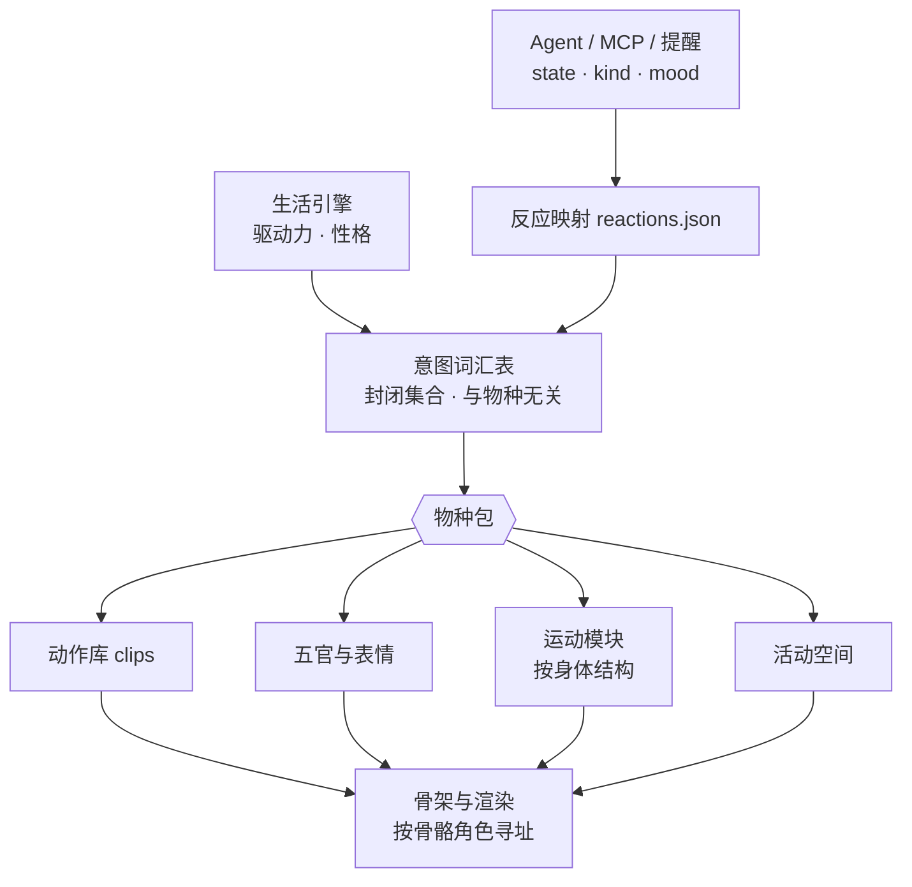

# 物种包：多物种支持的架构设计

**状态**：设计稿，2026-09-24。**代码尚未实现**，本文描述的接口在仓库里都还不存在。
决策与理由见 [决策 005](decisions/005-species-packs.md)。
本文和代码不一致不是 bug，是还没做；等迁移步骤落地时，把对应章节移进当前规格。

---

## 1. 目标与非目标

**目标**

- 桌宠能以同一套应用，跑猫以外的物种：狗、鸟、人、鱼。
- Agent、MCP 工具、`reactions.json`、提醒、记忆对物种无感：换物种，agent 侧零改动。
- 新增一个**已有身体结构**的物种（例如狗），只加数据和参数，不改引擎代码。
- 物种包和现有自定义资源一样：**完整校验通过才替换，失败保留当前物种并说明原因**。

**非目标**

- 不做「所有物种共用一副通用骨架」。
- 不做运行时物种间的形变过渡（猫变成狗的动画）。
- 本阶段不改任何代码。

## 2. 术语

| 术语 | 含义 |
|---|---|
| **身体结构**（body plan） | 运动方式的分类：`quadruped` 四足、`biped` 双足、`avian` 鸟、`aquatic` 水生 |
| **物种包**（species pack） | 一个物种的全部差异：骨架、角色表、运动参数、活动空间、五官、动作库、意图映射、作息参数、台词风格 |
| **骨骼角色**（role） | 与物种无关的骨骼语义：`head`、`spine[]`、`tail[]`、`limb.foreL` 等 |
| **意图**（intent） | 与物种无关的「想表达什么」：`celebrate`、`comfort`、`rest`……（封闭集合） |
| **活动空间**（habitat） | 它在屏幕上怎么存在：站在地面、停在边缘、浮在水里 |
| **伙伴**（companion） | 物种包 + 皮肤 + 性格 + 记忆。身份和关系在这一层 |

## 3. 分层：哪些共享，哪些归物种



| 层 | 现在 | 目标 | 归属 |
|---|---|---|---|
| Agent 接口（`state`/`kind`/`mood`、MCP 工具） | 已与物种无关；动作 id 从 `lingxi_capabilities` 取 | 不变 | 共享 |
| 反应映射 `reactions.json` | 直接映射到表情名和动作 id | 默认映射到**意图**；仍允许直接写动作 id（高级用法），按当前物种包校验 | 共享 |
| 意图词汇表 | 不存在 | 新增，封闭集合（§5） | 共享 |
| 生活引擎 | 驱动力、性格已基本通用；作息与玩具是按猫写的 | 引擎只发出**自主行为意图**，作息曲线等参数由物种包提供 | 共享引擎 + 物种参数 |
| 动作库 | `actions.json`，通道按节点名寻址（`head.rotation.z`） | 通道可按角色寻址（`@head.rotation.z`），可跨物种复用 | 物种包（可复用部分共享） |
| 程序化层（呼吸、眨眼、看向、待机晃、弹簧） | 引用具体节点名 | 按角色寻址，物种缺某角色就跳过该层 | 共享 |
| 运动 | `gait.ts` 写死四条腿和猫的步法 | 按身体结构的运动模块 + 物种参数 | 模块共享，参数归物种 |
| 活动空间 | 隐含「地面 + 重力」（`groundOffset`、着地规则） | 物种包声明 `habitat`，渲染和拖放按它走 | 模块共享，声明归物种 |
| 五官 | 5 层固定取值（`eye`/`brow`/`mouth`/`ear`/`symbol`），含猫专属值（`mouth: cat`、`ear: airplane`） | 物种包声明自己有哪些层、每层哪些取值 | 物种包 |
| 骨架与模型 | `skeleton.json`（`lingxi-cat-v1`，46 节点，体素） | 物种包声明骨架来源（体素 JSON 或 glTF）+ 角色表 | 物种包 |
| 皮肤 | `SkinManifest.rigId` 已做兼容检查 | 不变，`rigId` 指向物种包的骨架 | 已就绪 |
| 台词 | 按猫的口吻写 | 物种包提供口吻与台词池，意图相同 | 物种包 |

## 4. 物种包清单（`species.json` 草案）

```jsonc
{
  "format": "lingxi-species",
  "schemaVersion": 1,
  "id": "dog-shiba",
  "name": "柴犬",
  "bodyPlan": "quadruped",
  "status": "planned",                    // planned | playable | production

  "rig": {
    "kind": "voxel",                      // voxel | gltf
    "source": "rig/skeleton.json",        // 包内相对路径，禁止越界
    "rigId": "lingxi-dog-v1",             // 皮肤兼容用
    "roles": {                            // 骨骼角色 -> 节点 id（§6）
      "root": "hipC",
      "spine": ["hipC", "spine3", "spine2", "spine1"],
      "neck": ["neck2", "neck1"],
      "head": "head", "jaw": "jaw",
      "eye.L": "eyeL", "eye.R": "eyeR",
      "ear.L": "earL", "ear.R": "earR",
      "limb.foreL": ["upperFL", "lowerFL", "pawFL"],
      "limb.foreR": ["upperFR", "lowerFR", "pawFR"],
      "limb.hindL": ["thighL", "shinL", "footL", "pawBL"],
      "limb.hindR": ["thighR", "shinR", "footR", "pawBR"],
      "tail": ["tail0", "tail1", "tail2", "tail3"]
    }
  },

  "locomotion": {
    "module": "quadruped",
    "params": { "duty": 0.55, "footfall": "diagonal-trot", "runDuty": 0.4 }
  },

  "habitat": { "kind": "ground", "screenHeightPx": [90, 160] },

  "face": {
    "layers": {                           // 这个物种有哪些五官层、每层哪些取值
      "eye":   ["round", "happy", "closed", "soft", "wide"],
      "brow":  ["flat", "raise", "sad"],
      "mouth": ["closed", "open", "pant", "tongue"],
      "ear":   ["neutral", "forward", "back", "droop"],
      "symbol":["none", "heart", "question", "sleep", "sweat"]
    },
    "expressions": "face/expressions.json" // 必须覆盖共享情绪集（§5.2）
  },

  "clips": "clips/actions.json",
  "intents": "intents.json",              // 意图 -> 候选动作（§5）
  "life": {
    "rhythm": "diurnal",                  // crepuscular | diurnal | nocturnal
    "drives": { "energyRestorePerHour": 0.5, "sleepinessRisePerHour": 0.11 }
  },
  "toys": ["ball"],                       // 这个物种会玩哪些玩具
  "voice": { "lines": "voice/lines.json", "sound": "汪" },
  "license": { "spdx": "CC-BY-4.0", "author": "…" }
}
```

包的目录结构：

```
species/<id>/
├── species.json
├── rig/            skeleton.json 或 model.glb
├── clips/          actions.json（与现有 schemaVersion 2 同格式，通道可按角色寻址）
├── face/           expressions.json、五官贴图
├── intents.json
├── voice/          lines.json
└── skins/          可选：随包附带的皮肤
```

猫是**第一个物种包**：把现有 `skeleton.json`、`actions.json`、表情、`gait.ts` 的步法参数原样收进
`species/cat/`，角色表写成恒等映射。行为必须和现在完全一致（§9 步骤 1 的验收）。

## 5. 意图词汇表（共享、封闭）

### 5.1 意图

意图回答「想表达什么」，不回答「怎么动」。集合封闭：新增意图要改本文，不能由物种包自己发明
（物种包可以有额外动作，但只能通过直接动作 id 调用）。

| 意图 | 用在哪 | 猫 | 狗 | 鸟 | 鱼 |
|---|---|---|---|---|---|
| `greet` | 用户回来、第一次注意到用户 | 慢眨眼、蹭 | 摇尾、小跑过来 | 歪头、跳近 | 游到前面 |
| `attend` | `needs_input` / `needs_approval`，看向用户 | 抬头注视 | 竖耳、坐下 | 歪头盯 | 停住、面向 |
| `celebrate` | `completed` + `proud` | 竖尾、小跳 | 转圈、摇尾 | 扑翅 | 翻身、吐泡 |
| `comfort` | `failed` + `frustrated` / `sad`，接住坏情绪 | 靠近、踩奶 | 靠着、把头搁下 | 靠近、轻啄 | 慢慢游近 |
| `curious` | `curious`、新东西 | 歪头观察 | 歪头、嗅 | 歪头 | 绕圈 |
| `play` | `playful`、玩具 | 扑、拍 | 扑球、叼 | 跳、衔 | 追逐 |
| `rest` | 空闲、`weary` | 趴下 | 趴下 | 缩起来 | 悬停 |
| `sleep` | 困意越阈 | 蜷睡 | 侧睡 | 缩头 | 沉底慢漂 |
| `self_care` | 自主行为 | 舔毛 | 挠痒、抖毛 | 理羽 | — |
| `wander` | 自主行为 | 走动 | 走动、嗅地 | 跳/短飞 | 巡游 |
| `startle` | 被突然拖动、`anxious` | 炸毛后退 | 后退、低头 | 飞起 | 急转 |
| `idle` | 什么都不做 | 待机 | 待机 | 待机 | 待机 |

`intents.json` 的形状：

```jsonc
{
  "celebrate": [
    { "clip": "tail-up-hop", "weight": 3 },
    { "clip": "spin", "weight": 1, "requires": { "energyAbove": 0.4 } }
  ],
  "self_care": []                          // 空数组 = 这个物种没有这种行为，引擎跳过
}
```

**规则**：除了 `self_care`，每个意图至少映射一个动作，否则校验失败。
`lingxi_capabilities` 按当前物种包列出实际可用的意图和动作；agent 侧已经按「先查能力」工作，不用改。

### 5.2 共享情绪集

表情名（`安然`、`好奇`、`满足`……）是跨物种共享的情绪词，现有内置表情集（`apps/lingxi/src/rig/art.ts`）就是它的第一版，
但要先剔除物种专属的条目（例如 `喵喵`），这类表情留在猫的物种包里作为额外表情。
每个物种包必须实现全部共享情绪，可以额外多加。每个物种用自己的五官层取值来实现同一个情绪。

### 5.3 `reactions.json` 的兼容

- 默认映射从「动作 id」改成「意图」：`"completed:proud": { "intent": "celebrate", "expression": "开心" }`。
- 仍接受直接写 `"action": "tail-up-hop"`。切换物种时，指向不存在动作的条目**降级到同一反应的意图**；
  没有意图时跳过这条，并在主界面报一条可读的提示。不静默失败。

## 6. 骨骼角色表

动作和程序化层都按角色寻址，由物种包的角色表解析到具体节点。

| 角色 | 形状 | 说明 | 必需于 |
|---|---|---|---|
| `root` | 节点 | 身体重心、整体平移 | 全部 |
| `spine` | 链（尾→头） | 呼吸、弓背、扭身 | 全部 |
| `neck` | 链 | 可为空 | — |
| `head` | 节点 | 看向、歪头、五官挂点 | 全部 |
| `jaw` | 节点 | 张嘴 | quadruped, biped |
| `eye.L` / `eye.R` | 节点 | 眨眼、视线 | 全部 |
| `ear.L` / `ear.R` | 节点 | 可缺（鸟、鱼、部分人形） | — |
| `limb.foreL/R`、`limb.hindL/R` | 链（近→远，末端为接地点） | 四足 | quadruped |
| `limb.armL/R`、`limb.legL/R` | 链 | 双足 | biped |
| `limb.wingL/R`、`limb.legL/R` | 链 | 鸟 | avian |
| `fin.*` | 节点 | 鱼鳍，可多个 | aquatic |
| `tail` | 链 | 可缺（人） | — |

**动作通道寻址**（与现有 `actions.json` schemaVersion 2 兼容）：

- `head.rotation.z`：按**节点名**寻址（现有写法，物种专属动作）。
- `@head.rotation.z`：按**角色**寻址（可复用动作）。链角色用下标：`@tail[-1].rotation.x` 表示尾尖。
- 加载器检查动作用到的每个角色，当前物种缺失就**整个动作不可用**，不出现在 capabilities 里。
  不做「缺哪个通道就跳过哪个通道」，那会得到一个只动了一半的动作。

可跨物种复用的动作：慢眨眼、歪头、点头、看向、呼吸、惊讶后仰。
这些先改成按角色寻址，是从猫迁移出来时的第一批。

人形可以直接采用 VRM 的 humanoid 骨骼映射作为 `biped` 的角色表，这样社区现成的 VRM 模型就能导入。
VRM 自带许可证元数据，加载器必须读取并在界面上展示。

## 7. 运动模块与活动空间

### 7.1 运动模块（按身体结构，每种一个）

```ts
interface LocomotionModule {
  readonly bodyPlan: 'quadruped' | 'biped' | 'avian' | 'aquatic';
  /** 这个模块支持哪些移动方式；director 只会请求这里列出的。 */
  readonly gaits: ReadonlyArray<'walk' | 'run' | 'hop' | 'fly' | 'swim' | 'glide'>;
  bind(rig: Rig, roles: RoleMap, params: unknown): void;   // params 由物种包提供并在此校验
  /** 由移动距离驱动，而不是时钟——与现在的 gait.ts 同一原则：脚不打滑。 */
  update(dt: number, velocity: Vec2, odometer: number): void;
  settle(): void;                                          // 停下时回到站/悬停姿态
}
```

| 模块 | 物种 | 要点 |
|---|---|---|
| `quadruped` | 猫、狗、狐、兔 | 就是现在的 `gait.ts`，把 `LEG_PHASE`、`DUTY` 变成参数：猫同侧交替步，狗对角小跑 |
| `biped` | 人、站立的鸟 | 两足支撑相、重心左右移；手臂反向摆 |
| `avian` | 鸟 | 地面跳 + 短飞；飞行时脚收起，翅膀周期与速度挂钩 |
| `aquatic` | 鱼 | 脊柱链行波（身体摆动），没有支撑相；速度决定摆频 |

### 7.2 活动空间

| `habitat.kind` | 在屏幕上 | 重力 / 着地 | 拖放 | 物种 |
|---|---|---|---|---|
| `ground` | 站在屏幕底部或窗口顶边 | 有，`groundOffset` 生效 | 松手落下 | 猫、狗、人 |
| `perch` | 停在窗口边、屏幕边 | 飞行时关闭 | 松手飞回最近的边 | 鸟 |
| `volume` | 在一个半透明的「水域」范围内 | 关闭，有浮力和阻力 | 松手慢慢游回水域 | 鱼 |

现在渲染里所有「着地」规则（`root.position.y` 以外的通道不能让脚离地、`leavesFloor()` 判定）
都属于 `ground`，迁移时收进这个活动空间的实现里，而不是删掉。

## 8. 校验与加载

沿用 `custom-assets.ts` 的纪律：**完整校验通过才替换**。

1. 路径：只允许包内相对路径；拒绝越界、符号链接、可执行文件。
2. 骨架：能构建；`roles` 里每个节点存在；满足 `bodyPlan` 的必需角色（§6）。
3. 运动：`locomotion.module` 与 `bodyPlan` 一致；参数通过模块自己的校验。
4. 动作：每个通道能解析；按角色寻址的动作所需角色齐全。
5. 意图：除 `self_care` 外，每个意图至少一个可用动作。
6. 表情：覆盖共享情绪集；每个取值都在 `face.layers` 声明里。
7. 皮肤：`rigId` 与包一致。
8. 许可证：必须有；缺失则状态最高 `planned`，不能在正式构建中启用。

任一步失败：保留当前物种，主界面列出失败原因（一条原因对应一个文件）。

## 9. 迁移步骤（等猫的造型批准之后）

每一步都必须保证猫的行为与上一步完全一致，才能进入下一步。

| 步骤 | 做什么 | 验收 |
|---|---|---|
| 0（现在） | 本文 + 决策 005；新写的 `anim/` 代码按角色寻址 | 无代码行为变化 |
| 1 | 把猫收成 `species/cat/`：角色表恒等映射，`gait.ts` 参数化为 `quadruped` 模块 | 所有动作逐帧采样与迁移前一致；截图对比无差异 |
| 2 | 加意图层；内置 `reactions.json` 改写成意图 | `/integration` 输出的反应结果与迁移前一致 |
| 3 | 抽出活动空间，只实现 `ground` | 着地、跳跃、拖放行为不变 |
| 4 | 程序化层与可复用动作改为按角色寻址 | 同上 |
| 5 | **狗**：只加 `species/dog-*/` 和步法参数 | **director、renderer、life-engine 零改动**（决策 005 的判据） |
| 6+ | 鸟（`avian` + `perch`）、人（`biped`，VRM 导入）、鱼（`aquatic` + `volume`） | 每一种新身体结构各开一份决策记录 |

## 10. 现有代码里与猫绑定的地方（2026-09-24 盘点）

迁移步骤 1–4 要处理的就是这张表。数字是直接写死节点名的处数。

| 位置 | 绑定方式 | 处数 |
|---|---|---|
| `apps/lingxi/src/anim/gait.ts` | `LEG_PHASE` 写死四条腿、同侧交替步、`DUTY` 常量 | 4 |
| `apps/lingxi/src/anim/body-flex.ts` | 脊柱、四肢节点名 | 18 |
| `apps/lingxi/src/anim/idle.ts` | 待机动作节点名 | 10 |
| `apps/lingxi/src/renderer.ts` | 五官挂在 `'head'` 上、按头盒尺寸定位 | 8 |
| `apps/lingxi/src/rig/art.ts` | 五官层取值含猫专属值（`mouth: cat/hiss`、`ear: airplane`） | 7 |
| `apps/lingxi/src/anim/body-controller.ts` | 节点名 | 6 |
| `apps/lingxi/src/anim/director.ts` | 节点名 | 1 |
| `apps/lingxi/src/data/actions.json` | 通道按节点名寻址 | 全部动作 |
| `apps/lingxi/src/data/skeleton.json` | `lingxi-cat-v1`，46 节点 | — |
| `packages/life-engine` | 玩具（球、逗猫棒）、晨昏作息写在引擎里 | — |

已经与物种无关、不用动的：Agent 词汇（`state`/`kind`/`mood`）、MCP 工具的能力发现、
`SkinManifest.rigId` 兼容检查、性格滑杆、记忆与提醒。

## 11. 资产管线（Blender 侧）

- 每个物种一个构建脚本（像 `scripts/blender/build_lingxi_v5.py`），脚本之间不必共享代码。
- **导出格式统一**：glTF（`.glb`），包含骨架、具名动作片段，并在 `extras` 里写角色表。
  这是 Blender 侧与应用之间唯一的约定。
- 通用工具可以共享：剪影测量（`metrics_render.py`）、骨骼变形校验（`verify_rig_deform.py`）、
  四视图对比。每个物种都要有自己的造型规格（参考 `assets/characters/lingxi/v5/LOOK-SPEC.md`）
  和参考设定图。「治愈」对每个物种的具体含义不一样，不能直接套猫的。

## 12. 未决问题

| 问题 | 谁来决定 | 备注 |
|---|---|---|
| 同一只伙伴能不能换物种？换了，记忆和关系是否延续？ | 产品（用户） | 决策 004 说关系留在「这一只」身上；技术上记忆挂在伙伴上，两种都能做 |
| 能不能同时出现两只（猫和狗）？ | 产品 | 牵涉多 agent 仲裁（[决策 003](decisions/003-multi-agent-arbitration.md)）和舞台占用，本设计假设同一时刻只有一只 |
| 第三方物种包能不能执行代码？ | 安全 | 本设计假设**不能**：物种包只有数据，运动模块只能从内置的几种里选 |
| 实时毛发还是预渲染序列帧？ | 技术，待猫的造型定型后 | 影响 glTF 之外是否还要支持序列帧格式的物种包 |
