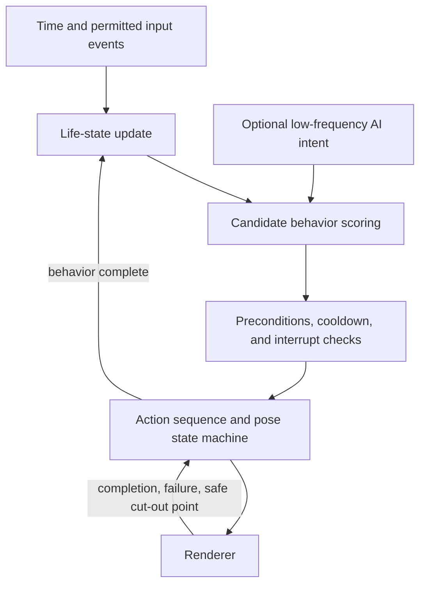
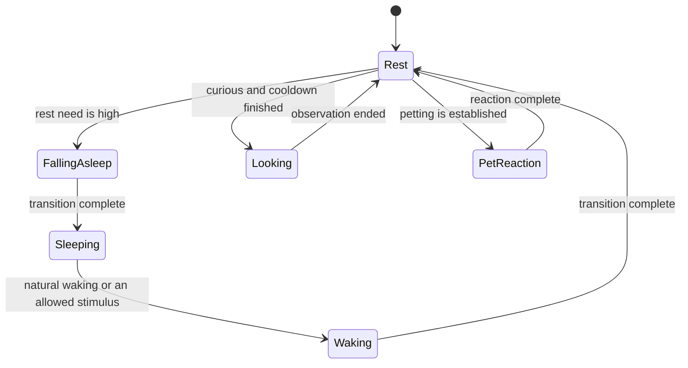

<!-- English translation of `docs/04-life-engine.md`. If this file and the Chinese source diverge, the Chinese source wins. -->

# Cat Life Engine: Behavior System

> Historical baseline (2026-09-10): the product is now named Lingxi, and the user requires real-time 3D as the goal. The latest decisions are in the [real-time 3D decision](decisions/001-realtime-desktop.md), [brand design](08-brand-and-design-system.md), and [extension architecture](09-extension-architecture.md). Older recommendations that conflict with the new decisions no longer apply.

Status: **partly implemented**. This document was originally a design draft in full. Part of what it describes is now running, so the boundary is stated first
—otherwise it would, in the other direction, repeat the fault of "docs out of sync with code."

**Already implemented, with tests (see `packages/life-engine`; 12 cases in `test/vitals.test.mjs`)**

| Design in this document | Implementation |
|---|---|
| Life variables `energy` / `sleepiness` | Present. 0–1, changing by the hour; consumed while awake, recovered while sleeping; walking burns faster than staying still |
| Time-of-day weights | Present. `nightness` is derived from the local clock, highest at 3 a.m., and pulls the sleepiness rise rate between 0.55× and 1.75× |
| Sleep loop | Present. Sleepiness crosses the threshold and the cat has settled → `sleep` state → recovery → it wakes on its own and stretches |
| Personality affects behavior weights | Present. Five sliders enter the engine: independence/curiosity change rest duration, gentleness changes walk speed, playfulness changes how hard it chases a toy, and sleep-loving (贪睡) changes the fall-asleep threshold. All at 0.5 equals the tuned defaults |
| Time cap after system sleep | Present. One tick advances life variables by at most 15 minutes, so eight hours with the lid closed does not instantly exhaust the cat |

**Still design only**

- `comfort` (comfort level), and `curiosity` as a **variable** (curiosity is currently only a personality term, not a quantity that rises and falls)
- Utility AI scoring to choose behavior: action choice is still in the director in the render layer, and is not scored from life variables
- Minimum dwell, switch-advantage threshold, repeat penalty, behavior cooldown (section 4) — this set of constraints at the action level is not in yet
- The emotion layer as an independent concept (expressions are currently given directly by the reaction map and the director)
- Persisting the "life-state version" in memory and continuity (vitals currently exist only in memory; a restart begins from the set initial values)

## 1. Layers and terms

| Term | Definition | Example |
| --- | --- | --- |
| Life variable | An internal number that changes continuously | Energy, sleepiness, comfort, curiosity |
| Emotion | A short-term state that affects expression | Relaxed, curious, drowsy |
| Intention | A high-level behavioral tendency | Rest, observe, stay nearby |
| Behavior | A task with preconditions and end conditions | Enter sleep, observe the pointer |
| Action clip | An asset that can actually be played | `sleep_to_rest` |
| Micro-action | A small change that is local or inside a clip | Blink, ear twitch, breath |
| Personality | A slow or fixed tendency | Independent, gentle, lazy |

Eyes looking at the pointer is not the same as seeing the user. Sensing time is not the same as knowing the real ambient light. Performance design can refer to the time of day, but it should not claim to have perceived information that was never collected.

## 2. Chain of responsibility



Utility AI is responsible for "what to choose." The state machine is responsible for "how to join legally." The action sequence is responsible for "by what steps it is completed." The MVP does not need to introduce a general behavior-tree framework at the same time. Evaluate that only after sequences and conditions are clearly complex.

## 3. First-version state and updates

Life variables are suggested to be normalized to 0–1: `energy`, `sleepiness`, `comfort`, `curiosity`. Personality is fixed as configuration first. Trust, attachment, and hunger stay as later design, so that unverifiable coupling is not introduced at the start.

Energy and sleepiness mean short-term capacity for activity and sleep pressure, respectively: play consumes energy, time awake raises sleepiness, and sleep restores both. Specific rates of change are tuned by simulation first. If the difference between the two cannot be explained, P0 may merge them into one rest need.

The behavior layer updates about once a second, or when an event arrives, and uses real elapsed time to compute change. Rendering uses an independent frame rate. Numeric ranges, rates, and time-of-day curves are configured in one place. They are not scattered through animation code. After system sleep, elapsed time is capped. Past behavior events are not emitted retroactively.

## 4. Decision rules

First filter candidates that cannot run: missing assets, incompatible pose, cooldown not finished, the user is dragging, the system is paused, and so on. Then compute a score from life variables, time of day, personality, and optional intent, and make a bounded random choice among a few high-scoring candidates.

All of the following are required at once: minimum dwell time, a switch-advantage threshold, a repeat penalty, behavior cooldown, and input coalescing. Randomness can only affect legal choices. It cannot make sleep and curiosity alternate every second. During debugging the random seed can be fixed, and the reason for the choice recorded.



Hide, quit, and drag are higher-priority interaction controls and may cut in immediately. Quitting should not wait for the cat to finish an animation. An ordinary pointer passing by during sleep need not wake it.

## 5. Interaction and micro-actions

The petting-reaction delay keeps the original 0.2–1.2 seconds as a tuning range, not as a response that must happen every time. Move events should be sampled and coalesced. Do not re-queue while an action is unfinished. Sleep and dragging reduce or turn off petting detection.

The real-time route can turn the eyes, then the head, then the body, and can layer local animation. The prerender route uses authored directional clips and micro-action variants. It cannot promise a continuous head turn or an independently procedural tail. Both routes have the same behavior layer request semantic behaviors such as "observe."

## 6. AI boundary

The M1 life loop does not depend on an LLM. Later AI receives only permitted summaries and the current state, and returns a high-level intent with a lifetime, for example:

```json
{
  "schemaVersion": 1,
  "intent": "stay_near",
  "emotion": "calm",
  "interaction": "none",
  "ttlSeconds": 300
}
```

This is a conceptual protocol. The implementation validates it with enums, a deadline, and magnitude constraints. Unknown values, timeouts, or expired responses are ignored, and local behavior continues. AI does not specify bones, does not bypass interrupt rules, does not call the operating system, and cannot stall the cat because an intent has no matching asset.

Calls are considered only for a meaningful summary change or for interaction the user starts, together with cooldown, a daily budget, and failure backoff. The per-second life update does not trigger a model request. Proactive language is controlled separately by the user's switch and a frequency cap.

## 7. Memory and verifiability

For M1, saving position, settings, the life-state version, and the update time is enough to show continuity. M2 is when explicit user preferences and a small number of interaction summaries are discussed. Semantic memory should be viewable and deletable. Model guesses must not be persisted as facts about the user.

Later implementation needs to verify: fixed input and seed can be replayed; a missing asset falls back to idle; no illegal jump happens before an action completes; continuous input does not queue without bound; it still works offline; sleep recovery has no backlog; a corrupt state file can recover the defaults.
