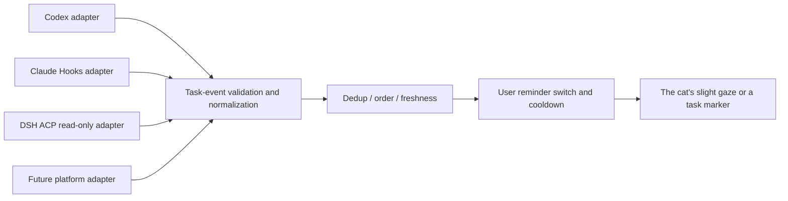

<!-- English translation of `docs/09-extension-architecture.md`. If this file and the Chinese source diverge, the Chinese source wins. -->

# Skins, Personality, and Agent Task Observation

2026-09-11. The user explicitly asked for multiple skins, multiple personalities, and task observation for Codex / Claude / DeepSeek Harness in the future. What is implemented now is an independent configuration contract and its validation, normalized storage of task state, and tests for those. A live platform connection is still a later feature.

## Character extension

`SkinManifest` describes the skin ID, compatible rig, material colors, and production status. `PersonalityManifest` describes independence, curiosity, gentleness, playfulness, sleepiness tendency, and interaction cooldown. The two are combined by `composeCompanion` and are not bound to each other. 暖绒虎斑 (Warm Velvet Tabby) and 银灰云朵 (Silver-Gray Cloud) are two planned skins. 安静陪伴 (Quiet Companionship) and 温柔好奇 (Gentle Curiosity) are two personality configurations that can be validated.

The current color configuration does not represent a complete production skin. A formal `SkinManifest v2` needs to add a constrained relative asset path, a version hash, texture masks, LOD, an animation compatibility list, and a license record. The loader rejects paths that escape the root and executable scripts. Validate the complete asset first, then replace it atomically. On failure, keep the old skin. A personality change should transition smoothly. It does not reset the cat's long-term identity and memory.

The interfaces are in [contracts](../../packages/contracts/src/index.d.mts). The data is in [skins](../../presets/skins/warm-tabby.json) and [personalities](../../presets/personalities/quiet.json). There is no faked model path meant to imply the assets are finished.

## Observation layer

A unified event contains platform, source, task, event ID, sequence number, observation time, and status. The task primary key includes platform and source, so the same name on different platforms does not collide. Statuses are queued, running, waiting for the user, completed, failed, cancelled, and unknown. A disconnect is marked stale only. It is not inferred to be complete. Summary length is limited to 240 characters. Raw fields in the input, such as the prompt and tool parameters, do not enter the normalized event.

`TaskObserver` provides only connect, snapshot, event stream, and disconnect. It does not provide approve, execute, or cancel interfaces. Adding a platform later does not require changing the cat's animation system.

## Integration paths that have been checked

| Platform | Source and interface | Boundary |
| --- | --- | --- |
| Codex | App Server `thread/status/changed`, `turn/started`, `turn/completed` | Can only observe tasks visible to a service that is already connected; it does not claim that newly opening app-server can automatically observe every task of the desktop app |
| Claude Code | Hooks `UserPromptSubmit`, `PermissionRequest`, `Stop`, `StopFailure`; a permission prompt may be supplemented by Notification | Stop is the end of one turn, not the completion of the user's goal; it does not output an approval decision; the Hooks the user chose must be installed |
| DeepSeek Harness | `dsh/jobs/list`, `dsh/agents/tree`, `dsh/sessions/watch`, and `dsh/changed` from the user's project `dsh-acp` | The client selects vendor extensions through capability negotiation; an unknown status stays unknown; resume/prompt/cancel are not called |

Codex's `turn/completed` carries completed/interrupted/failed. A turn and the user's long-term goal should be modeled separately. [Official App Server documentation](https://developers.openai.com/codex/app-server/)

Claude's StopFailure means the API ended on an error. A permission Hook may affect approval, so the observation implementation must only record metadata and exit, and must not return control fields. [Claude Hooks](https://code.claude.com/docs/en/hooks)

DSH has been read from the user's repository implementation, reference commit `e63dd06ccbebb68bc380532d5758968b17e247e4`. The task list includes id, kind, label, status, ownerSession, startedAt, finishedAt. [dsh-acp](https://github.com/dushaobindoudou/dsh-acp)

## Restraint and reliability of reminders

Task reminders are off by default. After they are turned on, each step while running stays quiet. Completion is only a slight head raise. Failure, or waiting for the user, shows a clear but restrained marker. Multiple events are merged, and a cooldown is set. Quiet mode suppresses animation and sound. Success, failure, and disconnect must be distinguished in text. An important status cannot be conveyed by the cat's expression alone.

On reconnect, reconcile with a snapshot first, then attach the increment. The adapter manages the source epoch and ordering. Data retention settings, task deletion, and source cleanup must be filled in when the transport layer is implemented, so it does not grow without bound. The current TaskStore already provides forget. It does not claim to have a complete retention policy.

## Verification boundary

Existing tests cover dedup, out-of-order delivery, source isolation, expiry, stripping of unrelated fields, configuration decoupling, rig compatibility, and the reminder switch. Live online observation has not been run against the three platforms. Protocol documents or unit tests are not treated as end-to-end connectivity evidence.
