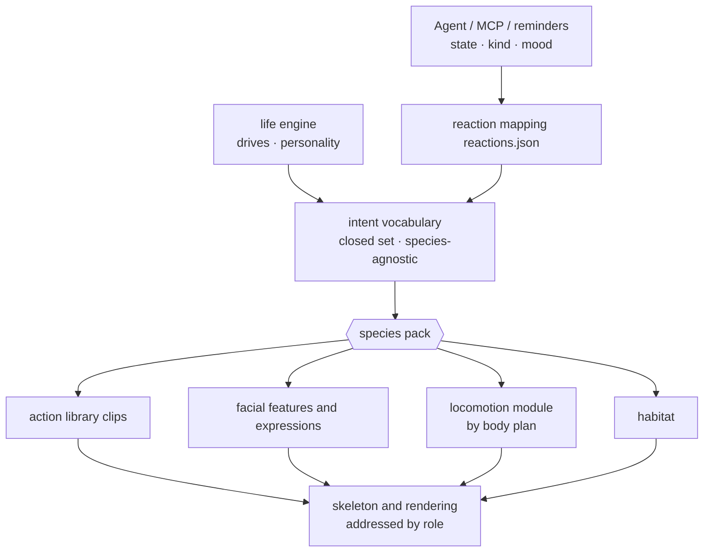

<!-- English translation of `docs/24-species-pack-design.md`. If this file and the Chinese source diverge, the Chinese source wins. -->

# Species packs: architecture design for multi-species support

**Status**: design document, 2026-09-24. **Not implemented in code**; every interface described here does not exist in the repository yet. Decisions and reasoning are in [Decision 005](decisions/005-species-packs.md). A discrepancy between this document and the code is not a bug — the work simply has not been done; when the migration steps land, move the corresponding sections into the current specs.

---

## 1. Goals and non-goals

**Goals**

- The desktop pet can run species other than the cat with the same app: dog, bird, human, fish.
- Agents, MCP tools, `reactions.json`, reminders, and memory are species-agnostic: switching species costs zero agent-side changes.
- Adding a species that **already has a body structure** (e.g. a dog) only adds data and parameters, no engine code.
- A species pack behaves like the existing custom assets: **it replaces the current species only after full validation passes; on failure the current species is kept and the reason is stated**.

**Non-goals**

- No "one shared generic skeleton for all species".
- No runtime morphing transition between species (an animation of the cat turning into a dog).
- No code changes in this phase.

## 2. Terminology

| Term | Meaning |
|---|---|
| **Body plan** | The classification of how it moves: `quadruped`, `biped`, `avian`, `aquatic` |
| **Species pack** | Every difference a species has: skeleton, role table, locomotion parameters, habitat, facial features, action library, intent mapping, daily-rhythm parameters, voice style |
| **Role** | Skeleton semantics independent of species: `head`, `spine[]`, `tail[]`, `limb.foreL` etc. |
| **Intent** | Species-agnostic "what it wants to express": `celebrate`, `comfort`, `rest`… (a closed set) |
| **Habitat** | How it exists on screen: standing on the ground, perching on an edge, floating in water |
| **Companion** | Species pack + skin + personality + memory. Identity and relationships live at this layer |

## 3. Layering: what is shared, what belongs to the species



| Layer | Now | Target | Owner |
|---|---|---|---|
| Agent interface (`state`/`kind`/`mood`, MCP tools) | Already species-agnostic; action ids come from `lingxi_capabilities` | unchanged | shared |
| Reaction mapping `reactions.json` | Maps straight to expression names and action ids | defaults to mapping to **intent**; still allows direct action ids (advanced use), validated against the current species pack | shared |
| Intent vocabulary | does not exist | new, a closed set (§5) | shared |
| Life engine | drives and personality are mostly generic; rhythm and toys are written for the cat | the engine only emits **autonomous behavior intents**; rhythm curves etc. come from the species pack | shared engine + species parameters |
| Action library | `actions.json`, channels addressed by node name (`head.rotation.z`) | channels can be addressed by role (`@head.rotation.z`), reusable across species | species pack (reusable parts shared) |
| Procedural layer (breathing, blinking, looking, idle sway, springs) | references specific node names | addressed by role; if a species lacks a role the layer is skipped | shared |
| Locomotion | `gait.ts` hard-codes four legs and the cat's gait | locomotion modules by body plan + species parameters | modules shared, parameters belong to the species |
| Habitat | implicitly "ground + gravity" (`groundOffset`, landing rules) | the species pack declares `habitat`; rendering and drag-drop follow it | module shared, declaration belongs to the species |
| Facial features | 5 fixed layers (`eye`/`brow`/`mouth`/`ear`/`symbol`), with cat-specific values (`mouth: cat`, `ear: airplane`) | the species pack declares which layers it has and which values per layer | species pack |
| Skeleton and model | `skeleton.json` (`lingxi-cat-v1`, 46 nodes, voxel) | the species pack declares the skeleton source (voxel JSON or glTF) + role table | species pack |
| Skin | `SkinManifest.rigId` already has a compatibility check | unchanged; `rigId` points at the species pack's skeleton | already ready |
| Voice | written in the cat's tone | the species pack provides tone and a line pool, with the same intents | species pack |

## 4. The species pack manifest (`species.json` draft)

```jsonc
{
  "format": "lingxi-species",
  "schemaVersion": 1,
  "id": "dog-shiba",
  "name": "Shiba Inu",
  "bodyPlan": "quadruped",
  "status": "planned",                    // planned | playable | production

  "rig": {
    "kind": "voxel",                      // voxel | gltf
    "source": "rig/skeleton.json",        // pack-relative path, no escaping allowed
    "rigId": "lingxi-dog-v1",             // for skin compatibility
    "roles": {                            // role -> node id (§6)
      "root": "hipC",
      "spine": ["hipC", "spine3", "spine2", "spine1"],
      "neck": ["neck2", "neck1"],
      "head": "head", "jaw": "jaw",
      "eye.L": "eyeL", "eye.R": "eyeR",
      "ear.L": "earL", "ear.R": "earR",
      "limb.foreL": ["upperFL", "lowerFL", "pawFL"],
      "limb.foreR": ["upperFR", "lowerFR", "pawFR"],
      "limb.hindL": ["thighL", "shinL", "footL", "pawBL"],
      "limb.hindR": ["thighR", "shinR", "footR", "pawBR"],
      "tail": ["tail0", "tail1", "tail2", "tail3"]
    }
  },

  "locomotion": {
    "module": "quadruped",
    "params": { "duty": 0.55, "footfall": "diagonal-trot", "runDuty": 0.4 }
  },

  "habitat": { "kind": "ground", "screenHeightPx": [90, 160] },

  "face": {
    "layers": {                           // which facial layers this species has, and which values per layer
      "eye":   ["round", "happy", "closed", "soft", "wide"],
      "brow":  ["flat", "raise", "sad"],
      "mouth": ["closed", "open", "pant", "tongue"],
      "ear":   ["neutral", "forward", "back", "droop"],
      "symbol":["none", "heart", "question", "sleep", "sweat"]
    },
    "expressions": "face/expressions.json" // must cover the shared emotion set (§5.2)
  },

  "clips": "clips/actions.json",
  "intents": "intents.json",              // intent -> candidate actions (§5)
  "life": {
    "rhythm": "diurnal",                  // crepuscular | diurnal | nocturnal
    "drives": { "energyRestorePerHour": 0.5, "sleepinessRisePerHour": 0.11 }
  },
  "toys": ["ball"],                       // which toys this species plays with
  "voice": { "lines": "voice/lines.json", "sound": "woof" },
  "license": { "spdx": "CC-BY-4.0", "author": "…" }
}
```

The pack's directory layout:

```
species/<id>/
├── species.json
├── rig/            skeleton.json or model.glb
├── clips/          actions.json (same format as the existing schemaVersion 2; channels can be addressed by role)
├── face/           expressions.json, facial-feature textures
├── intents.json
├── voice/          lines.json
└── skins/          optional: skins shipped with the pack
```

The cat is the **first species pack**: fold the existing `skeleton.json`, `actions.json`, expressions, and `gait.ts` gait parameters as-is into `species/cat/`, with the role table as an identity mapping. Behavior must be exactly the same as today (acceptance of §9 step 1).

## 5. The intent vocabulary (shared, closed)

### 5.1 Intents

An intent answers "what it wants to express", not "how it moves". The set is closed: adding an intent means editing this document; a species pack cannot invent its own (a pack may have extra actions, but only callable by direct action id).

| Intent | Used for | Cat | Dog | Bird | Fish |
|---|---|---|---|---|---|
| `greet` | the user returns, first notices the user | slow blink, rub | tail wag, trot over | tilt head, hop close | swim to the front |
| `attend` | `needs_input` / `needs_approval`, look at the user | raise head, look | prick ears, sit | tilt and stare | stop, face the user |
| `celebrate` | `completed` + `proud` | tail up, small hop | circle, wag tail | flap wings | flip, blow bubbles |
| `comfort` | `failed` + `frustrated` / `sad`, catch bad mood | come close, knead | lean, rest head | come close, peck softly | swim up slowly |
| `curious` | `curious`, something new | tilt head, observe | tilt, sniff | tilt head | circle |
| `play` | `playful`, toys | pounce, bat | fetch ball, carry | hop, pick up | chase |
| `rest` | idle, `weary` | lie down | lie down | tuck in | hover |
| `sleep` | sleepiness over threshold | curl up | sleep on side | tuck head | sink slowly |
| `self_care` | autonomous behavior | lick fur | scratch, shake fur | preen | — |
| `wander` | autonomous behavior | walk around | walk, sniff ground | hop/short flight | patrol |
| `startle` | suddenly dragged, `anxious` | bristle, back up | back up, lower head | fly up | turn sharply |
| `idle` | doing nothing | idle | idle | idle | idle |

The shape of `intents.json`:

```jsonc
{
  "celebrate": [
    { "clip": "tail-up-hop", "weight": 3 },
    { "clip": "spin", "weight": 1, "requires": { "energyAbove": 0.4 } }
  ],
  "self_care": []                          // empty array = this species has no such behavior; the engine skips it
}
```

**Rule**: apart from `self_care`, every intent must map to at least one action, or validation fails.
`lingxi_capabilities` lists the intents and actions actually available for the current species pack; the agent side already works on "query capabilities first", so no change is needed.

### 5.2 The shared emotion set

Expression names (`安然 calm`, `好奇 curious`, `满足 content`…) are emotion words shared across species; the existing built-in expression set (`apps/lingxi/src/rig/art.ts`) is its first version, but species-specific entries (e.g. `喵喵 meow`) must first be removed — those stay in the cat's species pack as extra expressions. Every species pack must implement the full shared emotion set and may add more. Each species implements the same emotion with its own facial-layer values.

### 5.3 `reactions.json` compatibility

- The default mapping changes from "action id" to "intent": `"completed:proud": { "intent": "celebrate", "expression": "happy" }`.
- Direct `"action": "tail-up-hop"` remains accepted. When switching species, an entry pointing at a nonexistent action **degrades to the same reaction's intent**; if there is no intent, the entry is skipped and a readable notice is shown in the main interface. No silent failure.

## 6. The role table

Actions and the procedural layer are both addressed by role, resolved to concrete nodes by the species pack's role table.

| Role | Shape | Description | Required for |
|---|---|---|---|
| `root` | node | body center of mass, whole-body translation | all |
| `spine` | chain (tail→head) | breathing, arching, twisting | all |
| `neck` | chain | may be empty | — |
| `head` | node | looking, tilting, facial-feature mount | all |
| `jaw` | node | open mouth | quadruped, biped |
| `eye.L` / `eye.R` | node | blinking, gaze | all |
| `ear.L` / `ear.R` | node | may be absent (bird, fish, some humanoids) | — |
| `limb.foreL/R`, `limb.hindL/R` | chain (near→far, far end is the ground contact) | quadrupeds | quadruped |
| `limb.armL/R`, `limb.legL/R` | chain | bipeds | biped |
| `limb.wingL/R`, `limb.legL/R` | chain | birds | avian |
| `fin.*` | node | fish fins, may be several | aquatic |
| `tail` | chain | may be absent (human) | — |

**Action channel addressing** (compatible with the existing `actions.json` schemaVersion 2):

- `head.rotation.z`: addressed by **node name** (existing style, species-specific actions).
- `@head.rotation.z`: addressed by **role** (reusable actions). Chain roles use an index: `@tail[-1].rotation.x` means the tail tip.
- The loader checks every role an action uses; if the current species lacks one, the **whole action is unavailable** and does not appear in capabilities. No "skip the missing channel" — that would produce an action that only moves halfway.

Actions reusable across species: slow blink, tilt head, nod, look, breathe, startled lean-back.
These are converted to role addressing first when migrating out of the cat.

Humanoids can adopt VRM's humanoid skeleton mapping directly as the `biped` role table, so community VRM models can be imported as-is. VRM carries license metadata, which the loader must read and show in the interface.

## 7. Locomotion modules and habitat

### 7.1 Locomotion modules (one per body plan)

```ts
interface LocomotionModule {
  readonly bodyPlan: 'quadruped' | 'biped' | 'avian' | 'aquatic';
  /** Which gaits this module supports; the director only requests those listed here. */
  readonly gaits: ReadonlyArray<'walk' | 'run' | 'hop' | 'fly' | 'swim' | 'glide'>;
  bind(rig: Rig, roles: RoleMap, params: unknown): void;   // params come from the species pack and are validated here
  /** Driven by distance travelled, not a clock — the same principle as the current gait.ts: feet do not slide. */
  update(dt: number, velocity: Vec2, odometer: number): void;
  settle(): void;                                          // return to the stand/hover pose when stopping
}
```

| Module | Species | Key points |
|---|---|---|
| `quadruped` | cat, dog, fox, rabbit | exactly the current `gait.ts`, turning `LEG_PHASE`, `DUTY` into parameters: cat = ipsilateral alternating, dog = diagonal trot |
| `biped` | human, standing bird | two-legged support phase, center of mass shifting side to side; arms swing opposite |
| `avian` | bird | ground hops + short flights; feet tucked during flight, wing cycle tied to speed |
| `aquatic` | fish | spinal-chain traveling wave (body undulation), no support phase; speed sets the undulation frequency |

### 7.2 Habitat

| `habitat.kind` | On screen | Gravity / landing | Drag-drop | Species |
|---|---|---|---|---|
| `ground` | stands on the bottom of the screen or the top edge of the window | yes, `groundOffset` applies | falls on release | cat, dog, human |
| `perch` | perches on window/screen edges | off while flying | flies back to the nearest edge on release | bird |
| `volume` | inside a translucent "water" range | off, with buoyancy and drag | slowly swims back into the water on release | fish |

Every "landing" rule currently in the renderer (`root.position.y` — channels other than it must not lift the feet off the ground, the `leavesFloor()` check) belongs to `ground`; during migration, fold it into that habitat's implementation rather than deleting it.

## 8. Validation and loading

Follow the discipline of `custom-assets.ts`: **replace only after full validation passes**.

1. Paths: only pack-relative paths allowed; reject escapes, symlinks, and executables.
2. Skeleton: must build; every node in `roles` exists; satisfies the `bodyPlan`'s required roles (§6).
3. Locomotion: `locomotion.module` matches `bodyPlan`; parameters pass the module's own validation.
4. Actions: every channel resolves; role-addressed actions have all roles they need.
5. Intents: apart from `self_care`, every intent has at least one available action.
6. Expressions: cover the shared emotion set; every value is declared in `face.layers`.
7. Skin: `rigId` matches the pack.
8. License: required; if missing, status is at most `planned` and it cannot be enabled in a production build.

If any step fails: keep the current species and list the failure reasons in the main interface (one reason per file).

## 9. Migration steps (after the cat's look is approved)

Each step must keep the cat's behavior exactly identical to the previous step before moving on.

| Step | What it does | Acceptance |
|---|---|---|
| 0 (now) | this document + Decision 005; newly written `anim/` code addresses by role | no behavioral code change |
| 1 | fold the cat into `species/cat/`: identity role mapping, parameterize `gait.ts` as the `quadruped` module | every action frame-sampled identical to before migration; screenshot comparison shows no difference |
| 2 | add the intent layer; rewrite the built-in `reactions.json` in terms of intents | `/integration` reaction output identical to before migration |
| 3 | extract the habitat, implement only `ground` | landing, jumping, drag-drop behavior unchanged |
| 4 | procedural layer and reusable actions addressed by role | same as above |
| 5 | **dog**: only add `species/dog-*/` and gait parameters | **zero changes to director, renderer, life-engine** (the criterion of Decision 005) |
| 6+ | bird (`avian` + `perch`), human (`biped`, VRM import), fish (`aquatic` + `volume`) | one decision record per new body plan |

## 10. Places in the current code bound to the cat (surveyed 2026-09-24)

Migration steps 1–4 deal with this table. The numbers are how many places hard-code node names.

| Location | How it binds | Count |
|---|---|---|
| `apps/lingxi/src/anim/gait.ts` | `LEG_PHASE` hard-codes four legs, ipsilateral alternation, `DUTY` constant | 4 |
| `apps/lingxi/src/anim/body-flex.ts` | spine, limb node names | 18 |
| `apps/lingxi/src/anim/idle.ts` | idle-action node names | 10 |
| `apps/lingxi/src/renderer.ts` | facial features mounted on `'head'`, positioned by head-box size | 8 |
| `apps/lingxi/src/rig/art.ts` | facial-layer values include cat-specific ones (`mouth: cat/hiss`, `ear: airplane`) | 7 |
| `apps/lingxi/src/anim/body-controller.ts` | node names | 6 |
| `apps/lingxi/src/anim/director.ts` | node names | 1 |
| `apps/lingxi/src/data/actions.json` | channels addressed by node name | all actions |
| `apps/lingxi/src/data/skeleton.json` | `lingxi-cat-v1`, 46 nodes | — |
| `packages/life-engine` | toys (ball, teaser wand), crepuscular rhythm written into the engine | — |

Already species-agnostic and not to be touched: agent vocabulary (`state`/`kind`/`mood`), MCP tool capability discovery, `SkinManifest.rigId` compatibility check, personality sliders, memory and reminders.

## 11. Asset pipeline (Blender side)

- One build script per species (like `scripts/blender/build_lingxi_v5.py`); the scripts need not share code.
- **Unified export format**: glTF (`.glb`), containing the skeleton, named action clips, and the role table written in `extras`. This is the only contract between the Blender side and the app.
- Shared generic tooling is fine: silhouette measurement (`metrics_render.py`), bone-deformation validation (`verify_rig_deform.py`), four-view comparison. Each species needs its own look spec (see `assets/characters/lingxi/v5/LOOK-SPEC.md`) and reference images. "Healing" means something different for each species; the cat's cannot be copied onto them.

## 12. Open questions

| Question | Who decides | Notes |
|---|---|---|
| Can a single companion switch species? If it does, do memory and relationships carry over? | product (user) | Decision 004 says the relationship stays with "this one"; technically memory hangs on the companion, and both options are buildable |
| Can two appear at once (cat and dog)? | product | involves multi-agent arbitration ([Decision 003](decisions/003-multi-agent-arbitration.md)) and stage occupancy; this design assumes only one at a time |
| Can a third-party species pack execute code? | security | this design assumes **no**: a pack is only data, and the locomotion module can only be chosen from the built-in ones |
| Real-time fur or pre-rendered frame sequences? | technical, after the cat's look is finalized | affects whether packs in frame-sequence format must be supported in addition to glTF |
